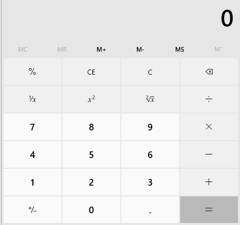

# click
***def click(
        self,
        click_type: Literal["click", "up", "down"] = ClickType.Click,
        mouse_button: Literal["left", "middle", "right"] = MouseButton.Left,
        click_location: Literal["center", "lefttop", "leftbottom", "righttop","rightbuttom"] = ClickLocation.Center,
        click_method: Union[Literal["default", "mouseemulation", "controlinvocation"], ClickMethod] = ClickMethod.Default,
        modifier_key: Literal["nonekey", "alt", "ctrl", "shift","win"]  = ModifierKey.NoneKey,
        xoffset: int = 0,
        yoffset: int = 0,
        xrate: int = 0,
        yrate: int = 0,
        timeout: int = 30
    ) -> None***  

Click an element with single click, up click or down click.  

**Parameters:**  
    &emsp;**click_type**: ClickType   
        &emsp;&emsp; click type for single click, up and down  
    &emsp;**mouse_button**: MouseButton  
        &emsp;&emsp; mouse button is set to define the mouse button to click. Default value is left, it will click with mouse left button  
    &emsp;**click_location**: ClickLocation  
        &emsp;&emsp; click location is set to define the element position to click. Default value is center, it will click the element's center position  
    &emsp;**click_method**: ClickMethod  
        &emsp;&emsp; click method is set to which method to use when clicking the element. Default vaule is default  
        &emsp;&emsp; `mouseemulation`: perform mouse emulator, will move mouse to the target element and click  
        &emsp;&emsp; `controlinvocation`: invoke the action on the target element, for web element, perform through javascript; for windows application element, it should support the action, or will be failed  
        &emsp;&emsp; `default`: for web element, will use `controlinvocation`; for desktop element, will use `mouseemulation`  
    &emsp;**modifier_key**: ModifierKey  
        &emsp;&emsp; modifier key is set to click with the modifier key("alt", "ctrl", "shift","win"). Default vaule is none    
    &emsp;**xoffset**: int 
        &emsp;&emsp; x offset is set the click position based on click_location. Default value is 0, means no offset  
    &emsp;**yoffset**: int  
        &emsp;&emsp; y offset is set the click position based on click_location. Default value is 0  
    &emsp;**xrate**: int  
        &emsp;&emsp; x rate percent of the click position based on click_location. Default value is 0, means no offset, if xrate is 1, means X of click postion move to right, the distance is 1*element's width pixsels  
    &emsp;**yrate**: int  
        &emsp;&emsp; y rate percent is set the click position based on click_location. Default value is 0, means no offset, if xrate is 1, means Y of click postion move to right, the distance is 1*element's height pixsels   
    &emsp;**timeout**: int  
        &emsp;&emsp; timeout for the operation. The unit of parameter is seconds. Default is set to 30 seconds  

**Returns:**  
    &emsp;None

**Example:**

- click left button
***
```python
    from clicknium import clicknium as cc, locator, ui
    ui(locator.chrome.bing.svg).click(mouse_button = "left")
    # same as
    cc.find_element(locator.chrome.bing.svg).click(mouse_button = "left")
    
```

- click with offset  


through clicknium recorder, recorde '5' button  
Default if we invoke click on button '5', `ui(locator.applicationframe.button_num5butto).click()`, will click on the central point of button '5'.  
We can set the xrate to 1, it will move the point from default(button '5' central position) to right， button '6' central position
`ui(locator.applicationframe.button_num5butto).click(xrate=1)`
We can set the yrate to 1, it will move the point from default(button '5' central position) to down button '2' central position
`ui(locator.applicationframe.button_num5butto).click(yrate=1)`  

- click with modifier_key  
for windows file explorer as the following:  
  
if we invoke click on control 'test3 folder' like  
`ui(locator.explorer.edit_system_item).click()`
the select item will be 'test3 folder', 'test1 folder' will be deselected.
  
if you want to add 'test3 folder' in selection list, you can click like the following:
`ui(locator.explorer.edit_system_item).click(modifier_key=ModifierKey.Ctrl)`
 