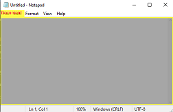

# Getting started<!-- {docsify-ignore-all} -->

- [Overview](#overview)
- [Installation​](#installation)
  - [System Requirements​](#system-requirements)
  - [Steps​](#steps)
- [First Web Automation Project](#first-web-automation-project)
- [First Windows Application Automation Project](#first-windows-application-automation-project)


## Overview

[Clickcorp](https://wwww.clickcorp.com) builds an open-source automation stack for developers to write software robot projects, and hosts cloud native approach products for software robot running and managment. Automation stack includes the following main parts: 

[Clicknium Python SDK](./doc/api/python/pythonsdk.md): Currently we provide Python SDK. If other programming languages are required, [create issue]()

[Clicknium Visual Studio Code Extension](./doc/developtools/vscode.md): Extensions for developers to create automation projects, capture UI elements, edit and manage UI element store,and provide Intellisense for writing code.  ​​

Clicknium clicknium Executor: 


## Installation​
### System Requirements​

Python: 3.7 or above

OS: Windows 7 Sp1 or above

### Steps​

- Install [Clicknium Visual Studio Code Extension](./doc/developtools/vscode.md)
- Install Python SDK through [pip]()

```
# Python 3.9 or below
pip install clicknium

# Python 3.10 or above
pip install --pre pythonnet
pip install clicknium
```
## First Web Automation Project
- [Install browser extension](./doc/developtools/extensions/extensions.md)
- In Visual Studio Code, open the Command Palette by pressing `Ctrl+Shift+P`
- Input or select: Clicknium:create project
- Select project path and name. The project is created.
  
- Open a browser, such as chrome, and navigate to `www.bing.com`
- In Visual Studio Code, open Clicknium recorder by pressing `Ctrl+F10` or clicking the following button    
  

- Record the input box and search button    
  
   
- Open app.py, and write the following code
```
from clicknium import clicknium as cc, locator, ui
#open new browser window
driver = cc.chrome.open("https://www.bing.com")
driver.find_element(locator.chrome.bing.search_sb_form_q).set_text("automation")
driver.find_element(locator.chrome.bing.svg).click
#automation on already opened browser
ui(locator.chrome.bing.search_sb_form_q).set_text("automation")
ui(locator.chrome.bing.svg).click
```

- Run the project

Open the Command Palette by pressing `Ctrl+Shift+P`, 

Input or select: clicknium:run project

## First Windows Application Automation Project
- In Visual Studio Code, Open the Command Palette by pressing `Ctrl+Shift+P`
- Input or select: clicknium:create project
- Select project path and name. The project is created.
- Open notepad
- In Visual Studio Ccode, open clicknium recorder by pressing `Ctrl+F10` or clicking the following button   
 
  
- Record the input document area

  
- Open app.py, and write the following code

```
from clicknium import clicknium as cc, locator, ui

ui(locator.notepad.document_15).set_text("automation")
```
- Run the project

Open the Command Palette by pressing `Ctrl+Shift+P`

Input or select: clicknium:run project
