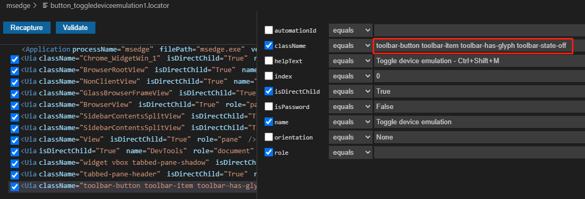
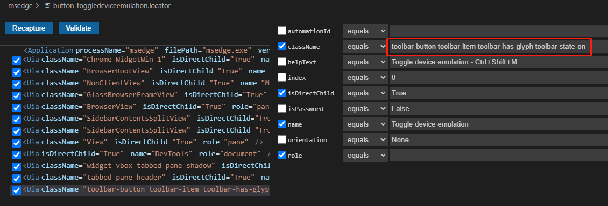
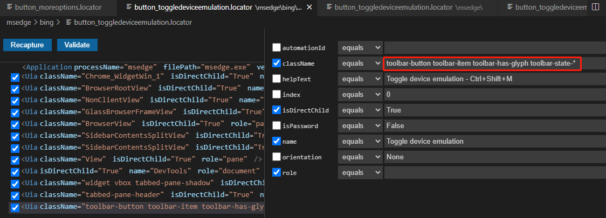

# Locator

Ui element locator is a string, actually XML fragment, content is in the following format:
<Application .../><Uia .../>/<Uia .../>  
<Application .../><Tab .../>/<Web .../>  
include all information to locate the element.
First node `Application` contains attributes of the target application
<Application processName="notepad" filePath="notepad.exe" version="1.3" />  

| Name      | Description |
| ----------- | ----------- |
| processName      |  name of the target process   |
| filePath      |  the process file name, can ignore during locate element  |
| version      |  clicknium locator schema version   |  

The last node contains the atrtbiutes of the targe Ui element.
The nodes between `Application` and the last node are the parent or ancestor of the target element.

The attributes in locator are used to identity the target element, the operator of attribute value is `equals` as default, we support the following operators:
`equals`, `contains`, `startWith`, `endWith`.  
Some attributes support wildword search, for example `name='test?_node*`. '?' match 1 character, '*' match 0 or more characters.  Only those attributes who support wildword search can use `contains`, `startWith`, `endWith`.  
Due to we support different automation technologies, they may have diffrent tag and attributes collection in locator schema. Here we list the attributes of each tag.  

## Uia
| Name      | equals | contains |startWith |endWith |
| ----------- | ----------- |----------- |----------- |----------- |
| Name |  <font color=Green><B>Yes</B></font>   |<font color=Green><B>Yes</B></font>|<font color=Green><B>Yes</B></font>|<font color=Green><B>Yes</B></font>|
| AutomationId |  <font color=Green><B>Yes</B></font>   |<font color=Green><B>Yes</B></font>|<font color=Green><B>Yes</B></font>|<font color=Green><B>Yes</B></font>|
| ClassName |  <font color=Green><B>Yes</B></font>   |<font color=Green><B>Yes</B></font>|<font color=Green><B>Yes</B></font>|<font color=Green><B>Yes</B></font>|
| HelpText |  <font color=Green><B>Yes</B></font>   |<font color=Green><B>Yes</B></font>|<font color=Green><B>Yes</B></font>|<font color=Green><B>Yes</B></font>|
| Role |  <font color=Green><B>Yes</B></font>   |<font color=Red><B>No</B></font>|<font color=Red><B>No</B></font>|<font color=Red><B>No</B></font>|
| IsDirectChild |  <font color=Green><B>Yes</B></font>   |<font color=Red><B>No</B></font>|<font color=Red><B>No</B></font>|<font color=Red><B>No</B></font>|
| AccessKey |  <font color=Green><B>Yes</B></font>   |<font color=Red><B>No</B></font>|<font color=Red><B>No</B></font>|<font color=Red><B>No</B></font>|
| IsPassword |  <font color=Green><B>Yes</B></font>   |<font color=Red><B>No</B></font>|<font color=Red><B>No</B></font>|<font color=Red><B>No</B></font>|
| AcceleratorKey |  <font color=Green><B>Yes</B></font>   |<font color=Red><B>No</B></font>|<font color=Red><B>No</B></font>|<font color=Red><B>No</B></font>|
| ItemType |  <font color=Green><B>Yes</B></font>   |<font color=Red><B>No</B></font>|<font color=Red><B>No</B></font>|<font color=Red><B>No</B></font>|
| ItemStatus |  <font color=Green><B>Yes</B></font>   |<font color=Red><B>No</B></font>|<font color=Red><B>No</B></font>|<font color=Red><B>No</B></font>|
| Orientation |  <font color=Green><B>Yes</B></font>   |<font color=Red><B>No</B></font>|<font color=Red><B>No</B></font>|<font color=Red><B>No</B></font>|
| Index |  <font color=Green><B>Yes</B></font>   |<font color=Red><B>No</B></font>|<font color=Red><B>No</B></font>|<font color=Red><B>No</B></font>|

## IA
| Name      | equals | contains |startWith |endWith |
| ----------- | ----------- |----------- |----------- |----------- |
| Name |  <font color=Green><B>Yes</B></font>   |<font color=Green><B>Yes</B></font>|<font color=Green><B>Yes</B></font>|<font color=Green><B>Yes</B></font>|
| AutomationId |  <font color=Green><B>Yes</B></font>   |<font color=Green><B>Yes</B></font>|<font color=Green><B>Yes</B></font>|<font color=Green><B>Yes</B></font>|
| ClassName |  <font color=Green><B>Yes</B></font>   |<font color=Green><B>Yes</B></font>|<font color=Green><B>Yes</B></font>|<font color=Green><B>Yes</B></font>|
| HelpText |  <font color=Green><B>Yes</B></font>   |<font color=Green><B>Yes</B></font>|<font color=Green><B>Yes</B></font>|<font color=Green><B>Yes</B></font>|
| AccessKey |  <font color=Green><B>Yes</B></font>   |<font color=Green><B>Yes</B></font>|<font color=Green><B>Yes</B></font>|<font color=Green><B>Yes</B></font>|
| DefaultAction |  <font color=Green><B>Yes</B></font>   |<font color=Green><B>Yes</B></font>|<font color=Green><B>Yes</B></font>|<font color=Green><B>Yes</B></font>|
| Description |  <font color=Green><B>Yes</B></font>   |<font color=Green><B>Yes</B></font>|<font color=Green><B>Yes</B></font>|<font color=Green><B>Yes</B></font>|
| Role |  <font color=Green><B>Yes</B></font>   |<font color=Red><B>No</B></font>|<font color=Red><B>No</B></font>|<font color=Red><B>No</B></font>|
| IsDirectChild |  <font color=Green><B>Yes</B></font>   |<font color=Red><B>No</B></font>|<font color=Red><B>No</B></font>|<font color=Red><B>No</B></font>|
| Tag |  <font color=Green><B>Yes</B></font>   |<font color=Red><B>No</B></font>|<font color=Red><B>No</B></font>|<font color=Red><B>No</B></font>|
| Index |  <font color=Green><B>Yes</B></font>   |<font color=Red><B>No</B></font>|<font color=Red><B>No</B></font>|<font color=Red><B>No</B></font>|

## Web Automation

### Tab
| Name      | equals | contains |startWith |endWith |
| ----------- | ----------- |----------- |----------- |----------- |
| Name |  <font color=Green><B>Yes</B></font>   |<font color=Green><B>Yes</B></font>|<font color=Green><B>Yes</B></font>|<font color=Green><B>Yes</B></font>|
| Title |  <font color=Green><B>Yes</B></font>   |<font color=Green><B>Yes</B></font>|<font color=Green><B>Yes</B></font>|<font color=Green><B>Yes</B></font>|
| URL |  <font color=Green><B>Yes</B></font>   |<font color=Green><B>Yes</B></font>|<font color=Green><B>Yes</B></font>|<font color=Green><B>Yes</B></font>|
| ClassName |  <font color=Green><B>Yes</B></font>   |<font color=Green><B>Yes</B></font>|<font color=Green><B>Yes</B></font>|<font color=Green><B>Yes</B></font>|
| Role |  <font color=Green><B>Yes</B></font>   |<font color=Red><B>No</B></font>|<font color=Red><B>No</B></font>|<font color=Red><B>No</B></font>|
| Index |  <font color=Green><B>Yes</B></font>   |<font color=Red><B>No</B></font>|<font color=Red><B>No</B></font>|<font color=Red><B>No</B></font>|

### Web
| Name      | equals | contains |startWith |endWith |
| ----------- | ----------- |----------- |----------- |----------- |
| Name |  <font color=Green><B>Yes</B></font>   |<font color=Green><B>Yes</B></font>|<font color=Green><B>Yes</B></font>|<font color=Green><B>Yes</B></font>|
| Id |  <font color=Green><B>Yes</B></font>   |<font color=Green><B>Yes</B></font>|<font color=Green><B>Yes</B></font>|<font color=Green><B>Yes</B></font>|
| Type |  <font color=Green><B>Yes</B></font>   |<font color=Green><B>Yes</B></font>|<font color=Green><B>Yes</B></font>|<font color=Green><B>Yes</B></font>|
| AncestorId |  <font color=Green><B>Yes</B></font>   |<font color=Green><B>Yes</B></font>|<font color=Green><B>Yes</B></font>|<font color=Green><B>Yes</B></font>|
| AncestorName |  <font color=Green><B>Yes</B></font>   |<font color=Green><B>Yes</B></font>|<font color=Green><B>Yes</B></font>|<font color=Green><B>Yes</B></font>|
| CssSelector |  <font color=Green><B>Yes</B></font>   |<font color=Green><B>Yes</B></font>|<font color=Green><B>Yes</B></font>|<font color=Green><B>Yes</B></font>|
| XPath |  <font color=Green><B>Yes</B></font>   |<font color=Green><B>Yes</B></font>|<font color=Green><B>Yes</B></font>|<font color=Green><B>Yes</B></font>|
| SInfo |  <font color=Green><B>Yes</B></font>   |<font color=Green><B>Yes</B></font>|<font color=Green><B>Yes</B></font>|<font color=Green><B>Yes</B></font>|
| TabIndex |  <font color=Green><B>Yes</B></font>   |<font color=Green><B>Yes</B></font>|<font color=Green><B>Yes</B></font>|<font color=Green><B>Yes</B></font>|
| Href |  <font color=Green><B>Yes</B></font>   |<font color=Green><B>Yes</B></font>|<font color=Green><B>Yes</B></font>|<font color=Green><B>Yes</B></font>|
| Src |  <font color=Green><B>Yes</B></font>   |<font color=Green><B>Yes</B></font>|<font color=Green><B>Yes</B></font>|<font color=Green><B>Yes</B></font>|
| Title |  <font color=Green><B>Yes</B></font>   |<font color=Green><B>Yes</B></font>|<font color=Green><B>Yes</B></font>|<font color=Green><B>Yes</B></font>|
| Tag |  <font color=Green><B>Yes</B></font>   |<font color=Red><B>No</B></font>|<font color=Red><B>No</B></font>|<font color=Red><B>No</B></font>|
| TableRow |  <font color=Green><B>Yes</B></font>   |<font color=Red><B>No</B></font>|<font color=Red><B>No</B></font>|<font color=Red><B>No</B></font>|
| TableCol |  <font color=Green><B>Yes</B></font>   |<font color=Red><B>No</B></font>|<font color=Red><B>No</B></font>|<font color=Red><B>No</B></font>|
| IsLeaf |  <font color=Green><B>Yes</B></font>   |<font color=Red><B>No</B></font>|<font color=Red><B>No</B></font>|<font color=Red><B>No</B></font>|
| Index |  <font color=Green><B>Yes</B></font>   |<font color=Red><B>No</B></font>|<font color=Red><B>No</B></font>|<font color=Red><B>No</B></font>|


# Examples
## wildword locator
Open Edge browser, press `F12` to show developer tool sidebar, you can see the 'Toggle device emulation' button.  
  
If you record the locator of 'Toggle device emulation' button, you can see the following locator
- normal mode  
  
  
- mobile emulation mode  

  

attribute classname is dynamic, so how to stable identify the 'Toggle device emulation' button? you can leverage wildword locator  
 

then in both mode, the button can be located succesfully.
And you can through get_property to know the current mode  
```
from clicknium import clicknium as cc, ui, locator

class_name = ui(locator.msedge.bing.button_toggledeviceemulation).get_property("ClassName")
if class_name.endswith('state-off'):
    print('normal mode')
else:
    print('mobile emulation mode')
```